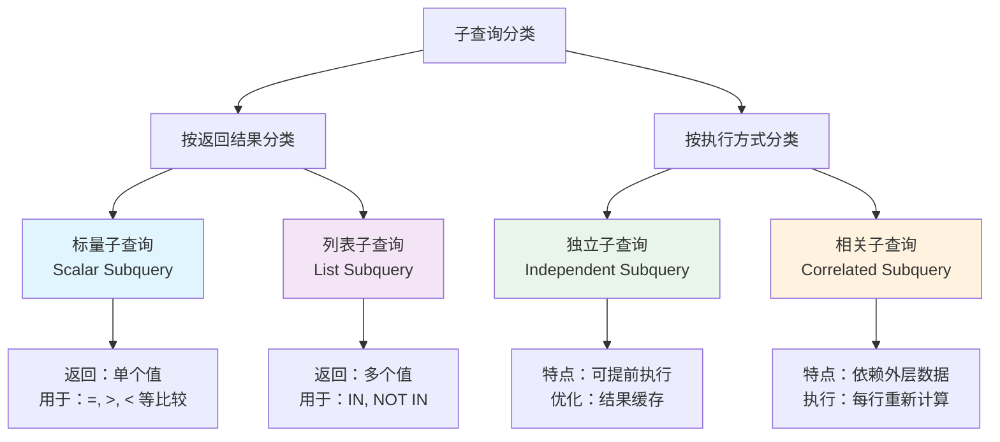
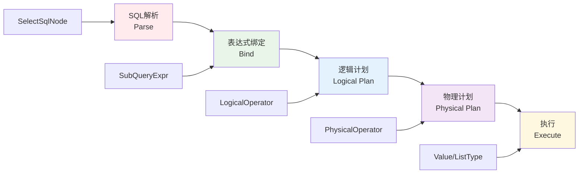
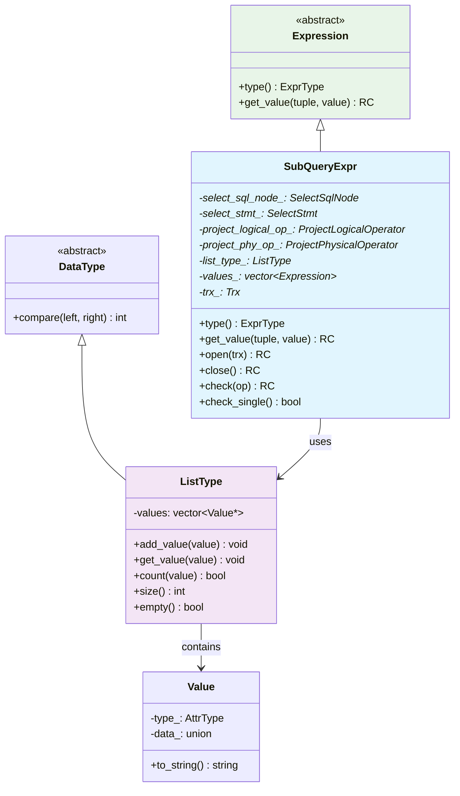
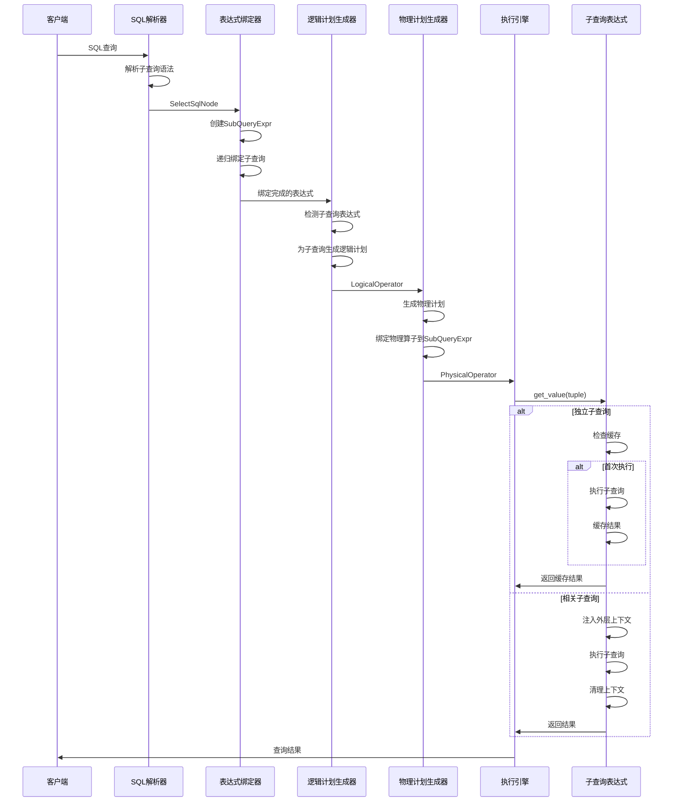
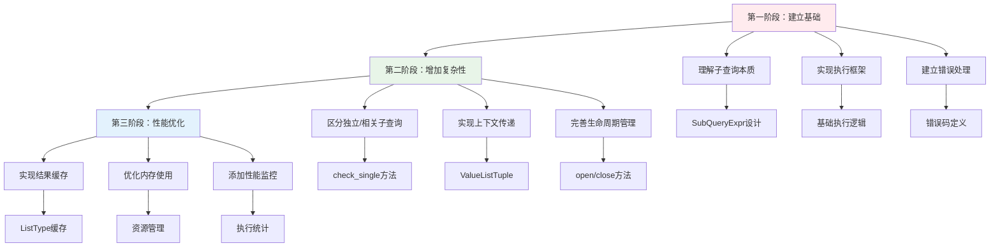
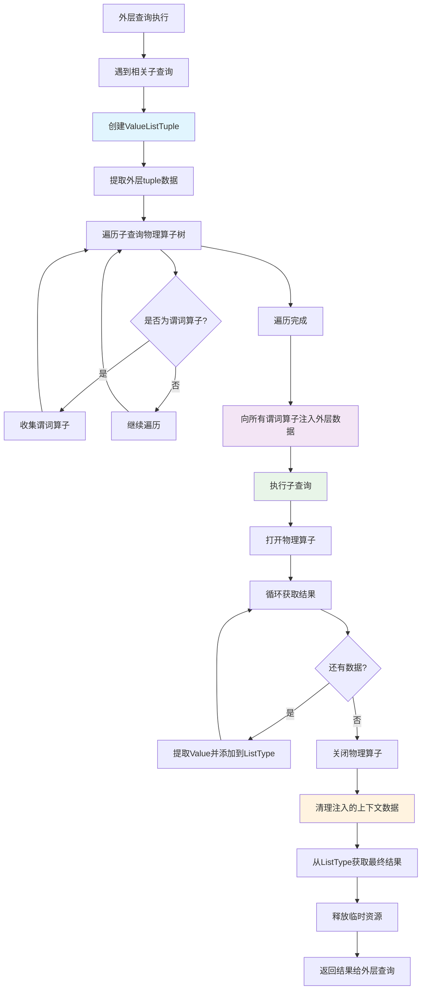
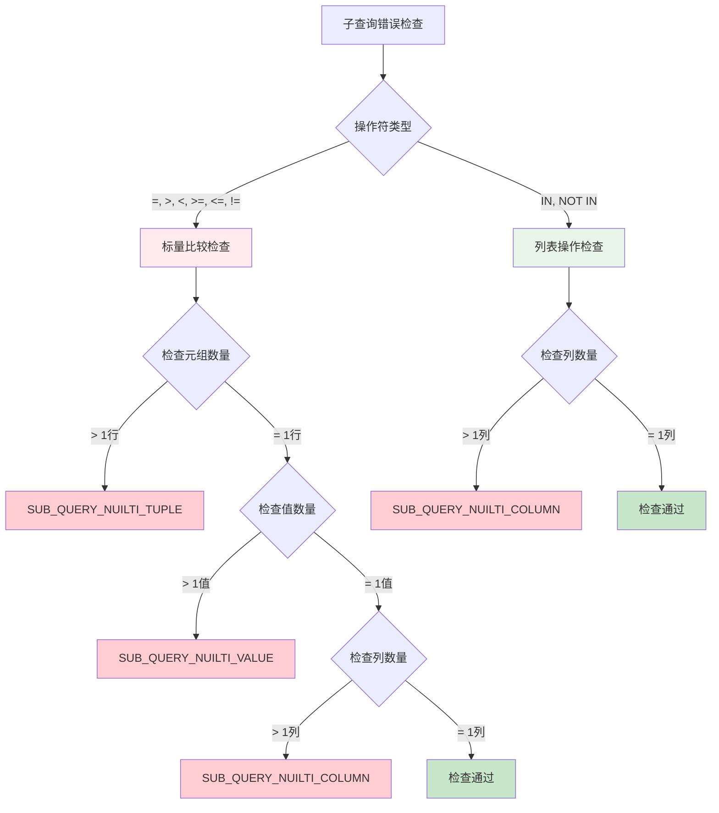
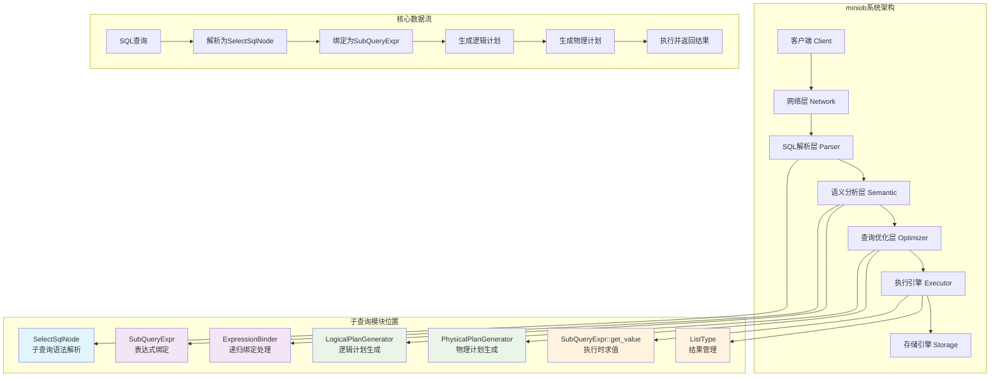
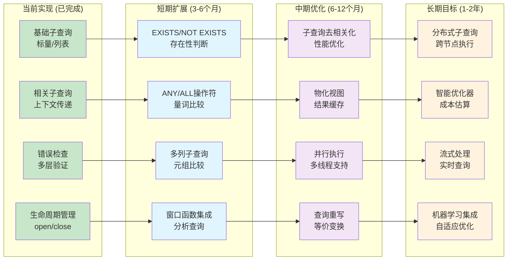
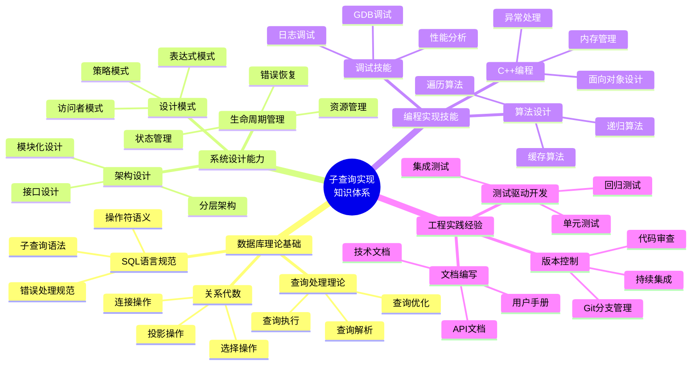

# miniob子查询功能教学指南

## 第一章：什么是子查询？

### 1.1 子查询的基本概念

子查询，顾名思义，就是在一个查询语句中嵌套另一个查询语句。让我们通过几个简单的例子来理解：

```sql
-- 基础查询：查找所有学生
SELECT * FROM students;

-- 子查询：查找年龄大于平均年龄的学生
SELECT * FROM students 
WHERE age > (SELECT AVG(age) FROM students);
```

在第二个查询中，`(SELECT AVG(age) FROM students)`就是一个子查询，它被嵌套在外层查询的WHERE条件中。

### 1.2 为什么需要子查询？

子查询解决了很多无法用单个查询完成的复杂问题：

**问题1：动态条件查询**
```sql
-- 需求：查找订单金额超过平均值的订单
-- 如果没有子查询，需要两步：
-- 第一步：SELECT AVG(amount) FROM orders;  -- 假设结果是1000
-- 第二步：SELECT * FROM orders WHERE amount > 1000;

-- 有了子查询，一步完成：
SELECT * FROM orders 
WHERE amount > (SELECT AVG(amount) FROM orders);
```

**问题2：集合包含关系**
```sql
-- 需求：查找购买过商品的客户
SELECT * FROM customers 
WHERE customer_id IN (SELECT customer_id FROM orders);
```

**问题3：存在性判断**
```sql
-- 需求：查找有订单的客户（未来可扩展EXISTS）
SELECT * FROM customers c
WHERE EXISTS (SELECT 1 FROM orders o WHERE o.customer_id = c.customer_id);
```

### 1.3 子查询的分类

根据返回结果的不同，子查询可以分为：

**标量子查询（Scalar Subquery）**：
- 返回单个值（一行一列）
- 通常用于比较操作
```sql
SELECT * FROM products WHERE price > (SELECT AVG(price) FROM products);
```

**列表子查询（List Subquery）**：
- 返回多个值（多行一列） 
- 通常用于IN/NOT IN操作
```sql
SELECT * FROM customers WHERE id IN (SELECT customer_id FROM orders);
```

**相关子查询（Correlated Subquery）**：
- 内层查询引用外层查询的字段
- 需要为外层每一行重新执行
```sql
SELECT * FROM employees e1 
WHERE salary > (SELECT AVG(salary) FROM employees e2 WHERE e2.dept = e1.dept);
```



## 第二章：miniob的设计思考

### 2.1 面临的挑战

当我们要在miniob中实现子查询时，面临几个关键问题：

**问题1：如何表示子查询？**
- 子查询本质上是一个可以返回值的表达式
- 需要集成到现有的表达式系统中

**问题2：何时执行子查询？**
- 独立子查询：可以提前执行，结果缓存
- 相关子查询：需要为外层每一行重新执行

**问题3：如何处理不同类型的返回值？**
- 标量值：单个Value对象
- 列表值：多个Value对象的集合

**问题4：如何保证正确性？**
- 标量子查询不能返回多行
- 列表子查询不能返回多列
- 需要完善的错误检查机制

### 2.2 设计决策

经过思考，我们做出了以下关键设计决策：

**决策1：子查询作为表达式类型**
```cpp
enum class ExprType {
  // ... 其他类型
  SUB_QUERY,    ///< 子查询表达式
};
```
**理由**：子查询本质上是一个计算单元，与字段表达式、值表达式没有本质区别。

**决策2：分层处理架构**
```
SQL解析 → 表达式绑定 → 逻辑计划 → 物理计划 → 执行
```
**理由**：遵循miniob的分层架构，每层职责明确。

**决策3：懒加载执行**
```cpp
RC SubQueryExpr::get_value(const Tuple &tuple, Value &value) const {
  if (list_type_ == nullptr) {
    // 第一次调用时才执行子查询
    execute_subquery();
  }
  // 返回缓存结果
}
```
**理由**：提高性能，避免不必要的计算。



### 2.3 核心组件设计

基于以上决策，我们设计了三个核心组件：

**组件1：SubQueryExpr类**
- 继承自Expression，表示子查询表达式
- 管理从SQL解析到执行的完整生命周期

**组件2：ListType类**
- 专门处理子查询返回的多值情况
- 统一标量值和列表值的处理接口

**组件3：错误检查机制**
- 多层次的错误检查
- 明确的错误码和错误信息



## 第三章：关键代码实现解析

### 3.1 SubQueryExpr类的实现

**文件位置**：`src/observer/sql/expr/expression.h` (第490-590行)

```cpp
class SubQueryExpr : public Expression
{
public:
  // 构造函数：支持两种子查询形式
  SubQueryExpr(SelectSqlNode* select_sql_node);     // SQL子查询
  SubQueryExpr(std::vector<std::unique_ptr<Expression>>* values); // 值列表

  ExprType type() const override { return ExprType::SUB_QUERY; }
  RC get_value(const Tuple &tuple, Value &value) const override;
  
  // 生命周期管理
  RC open(Trx* trx);
  RC close();
  
  // 错误检查
  RC check(CompOp op);
  bool check_single();

private:
  // 处理链：从SQL到执行的完整路径
  SelectSqlNode* select_sql_node_ = nullptr;        // 原始SQL节点
  SelectStmt* select_stmt_ = nullptr;               // 转换后的语句  
  ProjectLogicalOperator* project_logical_op_ = nullptr;  // 逻辑算子
  ProjectPhysicalOperator* project_phy_op_ = nullptr;     // 物理算子
  
  // 结果管理
  mutable ListType* list_type_ = nullptr;           // 结果缓存
  std::vector<std::unique_ptr<Expression>>* values_ = nullptr; // 值列表
  
  // 上下文管理
  std::vector<const Tuple*> tuples_;               // 缓存的元组
  Trx* trx_ = nullptr;                             // 事务上下文
};
```

**设计亮点分析**：
1. **双重构造函数**：支持真正的SQL子查询和简单的值列表
2. **完整生命周期**：从解析到执行的每个阶段都有对应的成员变量
3. **结果缓存**：通过`list_type_`实现一次计算、多次使用
4. **事务感知**：通过`trx_`支持事务上下文的传递

### 3.2 表达式绑定阶段的实现

**文件位置**：`src/observer/sql/parser/expression_binder.cpp`

这是子查询处理的第一个关键阶段，负责将解析的SQL转换为可执行的表达式：

```cpp
RC ExpressionBinder::bind_sub_expression(
    std::unique_ptr<Expression> &expr, 
    std::vector<std::unique_ptr<Expression>> &bound_expressions)
{
  SubQueryExpr * sub_query_expr = static_cast<SubQueryExpr *>(expr.release());
  
  if(sub_query_expr->select_sql_node() != nullptr) {
    // 情况1：真正的SQL子查询
    Stmt *stmt = nullptr;
    RC rc = SelectStmt::create(this->context_.db(), 
                              *sub_query_expr->select_sql_node(), stmt);
    if (OB_FAIL(rc)) {
      LOG_WARN("Failed to create select statement for subquery");
      return rc;
    }
    sub_query_expr->set_select_stmt(static_cast<SelectStmt *>(stmt));
  } else {
    // 情况2：值列表（如 IN (1,2,3)）
    auto* expressions = sub_query_expr->values();
    std::vector<std::unique_ptr<Expression>>* bound_values = 
        new std::vector<std::unique_ptr<Expression>>();
    
    // 绑定每个值表达式
    for(size_t i = 0; i < expressions->size(); ++i) {
      RC rc = bind_expression(expressions->at(i), *bound_values);
      if (OB_FAIL(rc)) {
        return rc;
      }
    }
    
    // 类型一致性检查
    for (size_t i = 1; i < bound_values->size(); ++i) {
      if (bound_values->at(i)->type() != bound_values->at(i - 1)->type()) {
        LOG_WARN("Type mismatch in value list");
        return RC::INVALID_ARGUMENT;
      }
    }
    
    sub_query_expr->values(bound_values);
  }
  
  bound_expressions.emplace_back(sub_query_expr);
  return RC::SUCCESS;
}
```

**关键处理逻辑**：
1. **类型识别**：区分SQL子查询和值列表
2. **递归处理**：对SQL子查询递归调用SelectStmt::create
3. **类型检查**：确保值列表中所有元素类型一致
4. **错误处理**：每个步骤都有相应的错误检查

### 3.3 ListType类的设计

**文件位置**：`src/observer/common/type/list_type.h` 和 `list_type.cpp`

```cpp
class ListType : public DataType
{
private:
  std::vector<Value*> values;

public:
  void add_value(Value* value);                    // 添加值到列表
  void get_value(Value& value);                   // 智能返回：单值或列表
  bool empty() { return this->values.empty(); }   // 检查是否为空
  int compare(const Value& left, const Value& right) const override;
  
  // 复杂子查询新增功能
  bool count(Value* value);                       // 检查值是否存在（去重）
  void add(Value* value);                         // 添加值（替代add_value）
  int size();                                     // 获取大小
  std::vector<Value*>& values_vector();           // 直接访问内部容器
};
```

**设计理念**：
- **类型统一**：通过继承DataType，与现有类型系统无缝集成
- **智能适配**：根据存储值的数量，自动决定返回单值还是列表
- **性能优化**：支持去重和快速查找

### 3.4 逻辑计划生成

**文件位置**：`src/observer/sql/optimizer/logical_plan_generator.cpp`

在逻辑计划生成阶段，系统检测表达式中的子查询并为其生成执行计划：

```cpp
RC LogicalPlanGenerator::create_plan(/* ... */) {
  // 检查比较表达式中的子查询
  if(left->type() == ExprType::SUB_QUERY) {
    auto sub_query_expr = static_cast<SubQueryExpr*>(left.get());
    if(sub_query_expr->select_stmt() != nullptr) {
      unique_ptr<LogicalOperator> sub_oper(nullptr);
      
      // 递归为子查询生成逻辑计划
      RC rc = create_plan(sub_query_expr->select_stmt(), sub_oper);
      if (OB_FAIL(rc)) {
        return rc;
      }
      
      // 将逻辑算子保存到子查询表达式中
      sub_query_expr->set_logical_op(
          static_cast<ProjectLogicalOperator *>(sub_oper.release()));
    }
  }
  // 类似地处理右操作数...
}
```

**核心思想**：
- **递归处理**：子查询被当作独立的查询单元
- **算子绑定**：将生成的逻辑算子直接绑定到表达式
- **延迟执行**：逻辑计划只是描述"怎么做"，不实际执行

### 3.5 物理计划生成

**文件位置**：`src/observer/sql/optimizer/physical_plan_generator.cpp`

物理计划生成阶段将逻辑计划转换为可执行的物理算子：

```cpp
RC PhysicalPlanGenerator::create_plan(/* ... */) {
  if (left->type() == ExprType::SUB_QUERY) {
    SubQueryExpr *left_sub_query_expr = static_cast<SubQueryExpr *>(left);
    if (left_sub_query_expr->logical_op() != nullptr) {
      unique_ptr<PhysicalOperator> child_phy_oper;
      
      // 为子查询的逻辑计划生成物理计划
      RC rc = create_plan(*left_sub_query_expr->logical_op(), child_phy_oper);
      if (OB_FAIL(rc)) {
        return rc;
      }
      
      // 将物理算子保存到子查询表达式中
      left_sub_query_expr->set_phy_op(
          static_cast<ProjectPhysicalOperator *>(child_phy_oper.release()));
      
      // 复杂子查询新增：错误检查
      RC check_rc = left_sub_query_expr->check(comparison_expr->comp());
      if (OB_FAIL(check_rc)) {
        return check_rc;
      }
    }
  }
}
```

### 3.6 执行阶段的核心逻辑

**文件位置**：`src/observer/sql/expr/expression.cpp`

执行阶段是最复杂的部分，需要处理独立子查询和相关子查询的不同执行策略：

```cpp
RC SubQueryExpr::get_value(const Tuple &tuple, Value &value) const
{
  RC rc = RC::SUCCESS;
  
  // 检查是否为独立子查询
  if (check_single()) {
    // 独立子查询：使用缓存结果
    if (list_type_ == nullptr) {
      // 第一次执行：需要初始化结果
      const_cast<SubQueryExpr*>(this)->list_type_ = new ListType();
      
      if (values_ != nullptr) {
        // 处理值列表情况
        for (auto& val_expr : *values_) {
          Value *value = new Value();
          rc = val_expr->get_value(tuple, *value);
          if (OB_FAIL(rc)) return rc;
          list_type_->add_value(value);
        }
      } else {
        // 处理SQL子查询情况
        rc = execute_sql_subquery();
        if (OB_FAIL(rc)) return rc;
      }
    }
    
    // 从缓存获取结果
    list_type_->get_value(value);
  } else {
    // 相关子查询：每次都重新执行
    rc = execute_correlated_subquery(tuple, value);
  }
  
  return rc;
}
```

**执行策略分析**：
1. **独立子查询**：第一次执行后缓存结果，后续直接返回
2. **相关子查询**：每次都需要重新执行，传递外层上下文
3. **懒加载**：只有在真正需要时才执行子查询

## 第四章：从简单到复杂的演进

### 4.1 基础子查询的实现（edu_subq分支）

基础实现专注于核心功能：

**支持的查询类型**：
```sql
-- 标量子查询
SELECT * FROM ssq_1 WHERE col1 = (SELECT AVG(ssq_2.col2) FROM ssq_2);

-- 列表子查询  
SELECT * FROM ssq_1 WHERE id IN (SELECT ssq_2.id FROM ssq_2);

-- 简单嵌套
SELECT * FROM ssq_1 WHERE col1 NOT IN (SELECT ssq_2.col2 FROM ssq_2);
```

**核心特点**：
- 所有子查询都是独立的（不相关）
- 结果一次计算，多次使用
- 基础的错误检查

### 4.2 复杂子查询的扩展（edu_complex_subq分支）

复杂实现增加了高级功能：

**新增的查询类型**：
```sql
-- 相关子查询
SELECT * FROM csq_1 WHERE feat1 <> (
  SELECT AVG(csq_2.feat2) FROM csq_2 WHERE csq_2.feat2 > csq_1.feat1
);

-- 多层嵌套相关子查询
SELECT * FROM csq_1 WHERE col1 NOT IN (
  SELECT csq_2.col2 FROM csq_2 WHERE csq_2.id IN (
    SELECT csq_3.id FROM csq_3 WHERE csq_1.id = csq_3.id
  )
);
```

**新增技术特性**：

**1. 生命周期管理**：
```cpp
RC SubQueryExpr::open(Trx* trx) {
  this->trx_ = trx;
  // 为相关子查询准备执行环境
}

RC SubQueryExpr::close() {
  // 清理资源
}
```

**2. 上下文传递机制**：
```cpp
// 新增文件：src/observer/sql/operator/operator_iterator.h
class OperatorIterator {
public:
  static RC iterate_child_oper(PhysicalOperator* expr, 
                               std::function<RC(PhysicalOperator*)> callback);
};
```

**3. 更严格的错误检查**：
```cpp
// 新增错误码：src/common/sys/rc.h
DEFINE_RC(SUB_QUERY_NUILTI_TUPLE)     // 多元组错误
DEFINE_RC(SUB_QUERY_NUILTI_VALUE)     // 多值错误
```



### 4.3 从教学角度看演进过程

**第一阶段：建立基础**
- 理解子查询的本质：表达式
- 实现基本的执行框架
- 建立错误处理机制

**第二阶段：增加复杂性**  
- 区分独立和相关子查询
- 实现上下文传递
- 完善生命周期管理

**第三阶段：性能优化**
- 实现结果缓存
- 优化内存使用
- 添加性能监控



## 第五章：核心算法详解

### 5.1 相关子查询的上下文传递算法

这是复杂子查询最核心的技术点：

```cpp
RC SubQueryExpr::execute_correlated_subquery(const Tuple& outer_tuple, Value& value) {
  // 步骤1：创建上下文传递的ValueListTuple
  auto *const_value_tuple = new ValueListTuple();
  RC rc = ValueListTuple::make(outer_tuple, *const_value_tuple);
  if (OB_FAIL(rc)) return rc;
  
  // 步骤2：遍历子查询的所有谓词算子
  vector<PredicatePhysicalOperator *> predicates;
  rc = OperatorIterator::iterate_child_oper(project_phy_op_,
      [&](PhysicalOperator *child) {
        if (child->type() == PhysicalOperatorType::PREDICATE) {
          predicates.push_back(static_cast<PredicatePhysicalOperator *>(child));
        }
        return RC::SUCCESS;
      });
  
  // 步骤3：将外层上下文注入到所有谓词算子
  for(auto& p : predicates) {
    p->add_value_tuple(*const_value_tuple);
  }
  
  // 步骤4：执行子查询
  ListType *list_type = new ListType();
  rc = project_phy_op_->open(this->trx_);
  if (OB_FAIL(rc)) return rc;
  
  while (OB_SUCC(rc = project_phy_op_->next())) {
    Tuple *tuple = project_phy_op_->current_tuple();
    Value *val = new Value();
    rc = tuple->cell_at(0, *val);
    if (OB_FAIL(rc)) break;
    list_type->add_value(val);
  }
  
  // 步骤5：清理上下文，返回结果
  for(auto& p : predicates) {
    p->clear_tuple();
  }
  project_phy_op_->close();
  
  list_type->get_value(value);
  delete list_type;
  delete const_value_tuple;
  
  return RC::SUCCESS;
}
```

**算法核心思想**：
1. **上下文提取**：将外层tuple转换为可传递的格式
2. **算子遍历**：找到所有需要外层数据的谓词算子
3. **数据注入**：将外层数据注入到内层查询的执行环境
4. **执行清理**：执行完成后清理注入的数据，避免污染



### 5.2 错误检查的层次化算法

```cpp
RC SubQueryExpr::check(CompOp op) {
  switch (op) {
    case EQUAL_TO: case LESS_THAN: case GREAT_THAN: 
    case LESS_EQUAL: case GREAT_EQUAL: case NOT_EQUAL:
      // 标量比较：必须是单一值
      
      // 检查层次1：元组数量
      if (!is_single_tuple()) {
        LOG_WARN("Scalar subquery returned more than one row");
        return RC::SUB_QUERY_NUILTI_TUPLE;
      }
      
      // 检查层次2：值数量
      if (list_type_ != nullptr && list_type_->size() != 1) {
        LOG_WARN("Scalar subquery returned %d values, expected 1", 
                 list_type_->size());
        return RC::SUB_QUERY_NUILTI_VALUE;
      }
      
      // 检查层次3：列数量
      if (project_phy_op_ != nullptr && project_phy_op_->select_size() != 1) {
        LOG_WARN("Scalar subquery returned %d columns, expected 1", 
                 project_phy_op_->select_size());
        return RC::SUB_QUERY_NUILTI_COLUMN;
      }
      break;
      
    case IN_: case NOT_IN:
      // 列表操作：允许多值，但必须单列
      if (project_phy_op_ != nullptr && project_phy_op_->select_size() != 1) {
        return RC::SUB_QUERY_NUILTI_COLUMN;
      }
      break;
  }
  return RC::SUCCESS;
}
```



## 第六章：测试用例分析

### 6.1 基础功能测试

**文件位置**：`test/case/test/primary-simple-sub-query.test`

```sql
-- 测试标量子查询
SELECT * FROM ssq_1 WHERE col1 = (SELECT AVG(ssq_2.col2) FROM ssq_2);

-- 测试IN操作
SELECT * FROM ssq_1 WHERE id IN (SELECT ssq_2.id FROM ssq_2);

-- 测试空结果处理
SELECT * FROM ssq_1 WHERE id IN (SELECT ssq_2.id FROM ssq_2 WHERE 1=0);
```

### 6.2 复杂功能测试

**文件位置**：`test/case/test/primary-complex-sub-query.test`

```sql
-- 测试多层嵌套
SELECT * FROM csq_1 WHERE id IN (
  SELECT csq_2.id FROM csq_2 WHERE csq_2.id IN (
    SELECT csq_3.id FROM csq_3
  )
);

-- 测试相关子查询
SELECT * FROM csq_1 WHERE feat1 <> (
  SELECT AVG(csq_2.feat2) FROM csq_2 WHERE csq_2.feat2 > csq_1.feat1
);
```

### 6.3 错误测试用例

```sql
-- 标量子查询返回多列（应该报错）
SELECT * FROM csq_1 WHERE col1 = (SELECT * FROM csq_2);

-- 标量子查询返回多行（应该报错）
SELECT * FROM csq_1 WHERE col1 = (SELECT csq_2.col2 FROM csq_2);
```

## 第七章：实践指导

### 7.1 如何运行和测试

**编译系统**：
```bash
cd miniob_2024
mkdir build && cd build
cmake .. && make
```

**运行测试**：
```bash
# 切换到edu_subq分支测试基础功能
git checkout edu_subq
./bin/observer -f ../etc/observer.ini

# 在客户端中运行：
source test/case/test/primary-simple-sub-query.test;

# 切换到edu_complex_subq分支测试复杂功能  
git checkout edu_complex_subq
source test/case/test/primary-complex-sub-query.test;
```



### 7.2 调试技巧

**1. 添加日志输出**：
```cpp
RC SubQueryExpr::get_value(const Tuple &tuple, Value &value) const {
  LOG_DEBUG("Executing subquery, check_single=%d", check_single());
  // ... 执行逻辑
  LOG_DEBUG("Subquery result: %s", value.to_string().c_str());
}
```

**2. 使用GDB调试**：
```bash
gdb ./bin/observer
(gdb) break SubQueryExpr::get_value
(gdb) run -f ../etc/observer.ini
```

**3. 验证结果正确性**：
- 与标准SQL数据库（如MySQL）的结果对比
- 检查边界条件的处理
- 验证错误检查的完整性

### 7.3 扩展思路

**功能扩展**：
1. **EXISTS/NOT EXISTS支持**
2. **ANY/ALL操作符**  
3. **标量子查询的优化**

**性能优化**：
1. **子查询去相关化**
2. **结果集物化**
3. **并行执行支持**



## 第八章：学习收获与思考

### 8.1 技术收获

通过实现子查询功能，我们学到了：

**系统设计方面**：
- **分层架构的重要性**：每一层都有明确的职责分工
- **表达式系统的扩展性**：通过继承和多态实现功能扩展
- **错误处理的完整性**：多层次的错误检查确保系统健壮性

**算法设计方面**：
- **懒加载策略**：在需要时才计算，提高性能
- **上下文传递机制**：相关子查询的核心技术
- **资源管理策略**：合理的生命周期管理避免内存泄漏

### 8.2 设计思考

**为什么选择表达式系统？**
- 子查询本质上是一个计算单元
- 可以复用现有的表达式处理框架
- 支持复杂的嵌套和组合

**为什么需要分层处理？**
- 解析层：处理SQL语法
- 绑定层：进行语义检查
- 计划层：生成执行策略  
- 执行层：实际运行并返回结果

**如何平衡性能和正确性？**
- 懒加载提高性能但增加实现复杂度
- 缓存机制减少重复计算但需要管理状态
- 早期错误检测避免无效计算但可能误判

### 8.3 实践经验

**开发建议**：
1. **从简单开始**：先实现基础功能，再逐步完善
2. **重视测试**：每个功能都要有对应的测试用例
3. **关注错误处理**：健壮的错误检查是系统质量的保证
4. **性能与正确性并重**：在优化性能的同时确保结果正确

**调试经验**：
1. **日志先行**：在关键路径添加详细日志
2. **分步验证**：每完成一个模块就进行测试
3. **边界测试**：特别关注空结果、异常输入的处理

### 8.4 后续发展方向

**短期目标**：
- 完善EXISTS/NOT EXISTS支持
- 实现更多的错误检查
- 优化相关子查询的性能

**长期目标**：  
- 实现查询优化器对子查询的优化
- 支持更复杂的嵌套场景
- 添加并行执行支持

## 总结

miniob的子查询实现是一个优秀的教学案例，它展示了如何在现有系统中添加复杂功能，同时保持代码的清晰性和可维护性。

**核心价值**：
- **教育意义**：清晰展示了数据库系统的实现原理
- **工程实践**：提供了可扩展、可维护的设计范例
- **技术参考**：为其他功能的实现提供了思路



通过深入学习这个实现，我们不仅理解了子查询的技术细节，更重要的是掌握了数据库系统设计的核心思想和最佳实践。这些知识将为我们后续的系统开发和架构设计提供宝贵的指导。
